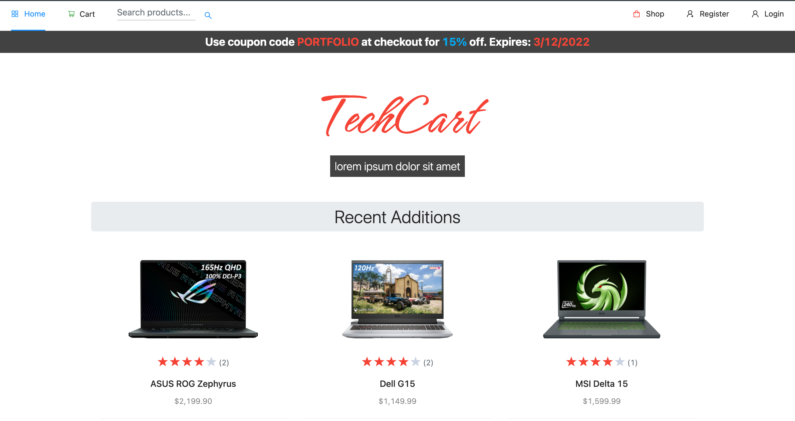

# TechCart

TechCart is a feature-rich E-commerce website built using the MERN stack.

> Features:
> Authentification with Firebase; authorization, sanitization, client and server-side routing; multiple image upload, toast messages, pagination, search/filter, wishlist, rate, cart, checkout, and a full admin dashboard with order management and CRUD abilities.

> Technologies used:
> React.js, Ant Design, Bootstrap Material Design, CSS, Redux, Node.js with Express.js, mongoDB with Mongoose, Cloudinary, Heroku, Firebase, Stripe, Jest, Enzyme, React Testing library, sinon

**To demo the application**:

- Register as a new user with an email
- And/or sign-in as the test admin account below to access admin functionality

| Email | Password   |
| -------- | ---------- |
| techcart.tester@gmail.com    | Admin_2021 |

Feel free to interact with the application fully (creating products, deleting categories, etc.)

[Try the live demo here](https://tech-cart.herokuapp.com/)
